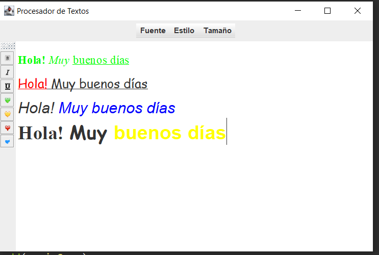

# Procesador de textos

Aplicación hecha con la biblioteca de interfaces gráficas java Swing. 
Proyecto guiado por el profesor Juan Díaz del canal de YouTube "Píldoras informáticas" en el curso de Java desde cero.

